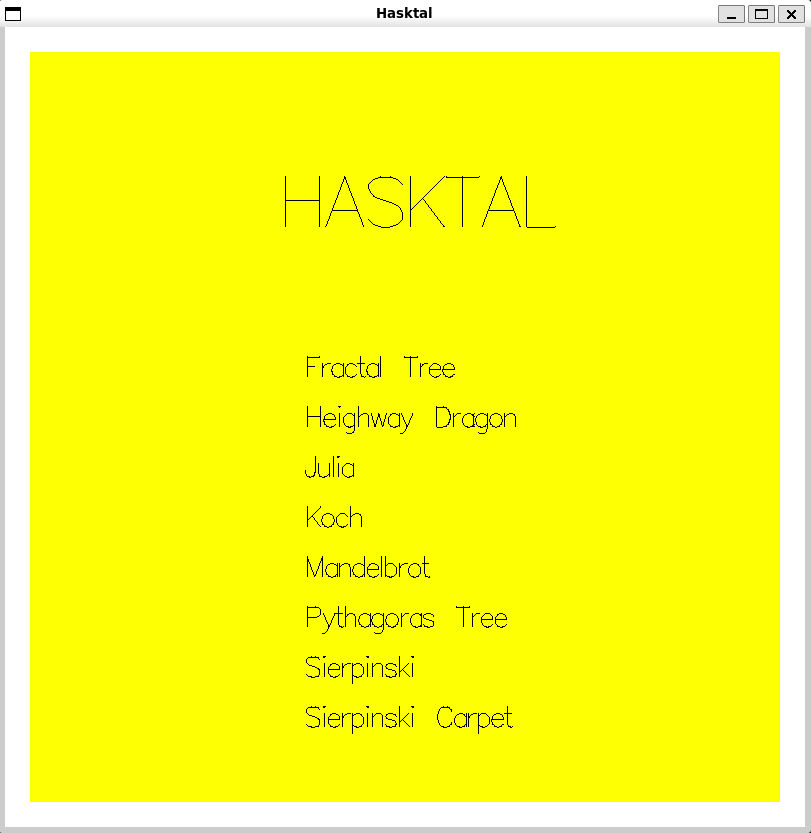

# Hasktal


**Disciplina**: FGA0210 - PARADIGMAS DE PROGRAMAÇÃO - T01 <br>
**Nro do Grupo (de acordo com a Planilha de Divisão dos Grupos)**: 02<br>
**Paradigma**: Funcional<br>

## Alunos
| Matrícula  | Aluno                              |
| ---------- | ---------------------------------- |
| 21/1039288 | Bruno Campos Ribeiro               |
| 21/1039297 | Bruno Martins Valério Bomfim       |
| 20/2016462 | Heitor Marques                     |
| 21/1029352 | Igor e Silva Penha                 |
| 19/0057858 | José Luís Ramos Teixeira           |
| 21/1029405 | Leonardo Gonçalves Machado         |
| 20/2016767 | Lucas Felipe Soares                |
| 20/0062379 | Marcos Vinícius de Deus            |
| 20/2045268 | Raquel T. Eucaria Pereira da Costa |
| 21/2002907 | Zenilda Pedrosa Vieira             |


## Sobre 

O projeto visa representar visualmente uma variedade de fractais gerados a partir de padrões repetitivos. Utilizando Haskell, serão desenvolvidos processos iterativos para criar diferentes tipos de fractais, explorando suas propriedades geométricas e características únicas derivadas de funções matemáticas específicas. 

Mais informações sobre cada fractal podem ser encontradas no documento de [descrição dos fractais desenvolvidos](./docs/descricaoFractais.md).


## Screenshots
A tela inicial mostra os fractais que foram desenvolvidos, conforme a **Imagem 1**. E o funcionamento no geral é apresentado no **Vídeo 1**.

<div align="center">
  <figure style="display: inline-block; margin-right: 20px;">
    
   <figcaption><br><strong>Imagem 1</strong>: Tela inicial com os fractais desenvolvidos <br> <strong>Fonte:</strong> <a href="https://github.com/zenildavieira">Zenilda Vieira</a>, 2024</figcaption>
  </figure>
</div>

<br>

<div align="center">
  <figure style="display: inline-block; margin-right: 20px;">
    
    <figcaption><br><strong>Vídeo 1:</strong> Exemplo de uso da interface <br> <strong>Fonte:</strong> <a href="https://github.com/igorpenhaa">Igor Penha</a>, 2024</figcaption>
  </figure>
</div>

## Instalação 
**Linguagens**: Haskell<br>
**Tecnologias**: Stack<br>
1. Instale o `stack`,  o tutorial de instalação pode ser encontrado [aqui](https://docs.haskellstack.org/en/stable/install_and_upgrade/).
2. Clone o repositório 
    ```bash
    git clone https://github.com/UnBParadigmas2024-2/2024.2_G2_Funcional_Hasktal.git
    ```
3. No terminal, abra o diretório onde o arquivo `hasktal.cabal` esta localizado e execute:
    ```bash
    stack build
    stack run
    ```

## Uso 
A partir dessa tela, é possível aumentar as iterações clicando no botão com o símbolo de mais (+), gerando progressivamente a imagem do fractal. O usuário também pode reduzir o número de iterações utilizando o botão com o símbolo de menos (-). Para retornar ao menu inicial e selecionar outro fractal, basta clicar no botão "Voltar".

## Vídeo
Adicione 1 ou mais vídeos com a execução do projeto.
Procure: 
(i) Introduzir o projeto;
(ii) Mostrar passo a passo o código, explicando-o, e deixando claro o que é de terceiros, e o que é contribuição real da equipe;
(iii) Apresentar particularidades do Paradigma, da Linguagem, e das Tecnologias, e
(iV) Apresentar lições aprendidas, contribuições, pendências, e ideias para trabalhos futuros.
OBS: TODOS DEVEM PARTICIPAR, CONFERINDO PONTOS DE VISTA.
TEMPO: +/- 15min

Clique [aqui](https://youtu.be/0ASRaD9DWEQ) para ver o vídeo!

## Participações
Apresente, brevemente, como cada membro do grupo contribuiu para o projeto.
|Nome do Membro | Contribuição | Significância da Contribuição para o Projeto (Excelente/Boa/Regular/Ruim/Nula) | Comprobatórios (ex. links para commits)
| -- | -- | -- | -- |
|  Bruno Campos Ribeiro |
|  Bruno Martins Valério Bomfim | (1) Estudo individual, pesquisa e testes;<br> (2) Programação, desenvolvimento e aprimoramento do algoritmo de geração do fractal de Koch;<br> (3) Auxílio no desenvolvimento do menu principal;<br> (4) Auxílio na padronização e estruturação da arquitetura do projeto;<br> (5) Apresentação da seção de "interface + fractal de koch" na produção do vídeo;<br> (6) Participação nas reuniões e discussões em equipe, colaborando com ideias e sugestões (via Teams e Telegram) | Excelente |  (1) [Commit 8344c64](https://github.com/UnBParadigmas2024-2/2024.2_G2_Funcional_Hasktal/commit/8344c64c096453b8ca36ea51b2d5f91f1b1a07ed) <br> (2) [Commit 2b075e5](https://github.com/UnBParadigmas2024-2/2024.2_G2_Funcional_Hasktal/commit/2b075e5b59d17c1209d08bdd96993e9ea6134f6b) <br> (3) [Commit 355c7a5](https://github.com/UnBParadigmas2024-2/2024.2_G2_Funcional_Hasktal/commit/355c7a53cb0f3aa824be101154bed7782a7e15a9), [Commit ed33c37](https://github.com/UnBParadigmas2024-2/2024.2_G2_Funcional_Hasktal/commit/ed33c37197b6cb57e6fdbde8a9892c01b49380c7) <br> (4) [Commit ad8ad5f](https://github.com/UnBParadigmas2024-2/2024.2_G2_Funcional_Hasktal/commit/ad8ad5f917fa60c845cc0c9ffe8d644fe8842e7e) <br> (5) [Vídeo](https://github.com/UnBParadigmas2024-2/2024.2_G2_Funcional_Hasktal?tab=readme-ov-file#v%C3%ADdeo) | 
|  Heitor Marques| Programação do fractal Árvore de Pitágoras, documentação sobre fractal Árvore de Pitágoras e documentação sobre fractais |  Excelente | [Árvore de Pitágoras](https://github.com/UnBParadigmas2024-2/2024.2_G2_Funcional_Hasktal/commit/df4288c61085d8cfb6157bc12b2e026439acd394) <br> [Doc. Árvore de Pitágoras](https://github.com/UnBParadigmas2024-2/2024.2_G2_Funcional_Hasktal/commit/f886a43ffaf30b0c1a3dd396ad0a84d7d84a8819) <br> [Doc. fractais](https://github.com/UnBParadigmas2024-2/2024.2_G2_Funcional_Hasktal/commit/4450cd5b616c1b7c44c20c6fdfad0b7f5c52b1c9)|
|  Igor e Silva Penha | (1) Programação, desenvolvimento e aprimoramento dos algoritmo de geração dos fractais Curva de Dragão (Heighway Dragon) e Triângulo de Sierpinski;<br> (2) Elaboração da interface inicial do trabalho;<br> (3) Padronização e estruturação da arquitetura do projeto;<br> (4) Participação nas reuniões e discussões em equipe, colaborando com ideias e sugestões (via Teams e Telegram); <br> (5) Revisão de código e documentação. | Excelente | (1) [Commit fe50623](https://github.com/UnBParadigmas2024-2/2024.2_G2_Funcional_Hasktal/commit/45106c744d18463482bc521faaa49fcfbdef226f) <br> (1) [commit edfe80b](https://github.com/UnBParadigmas2024-2/2024.2_G2_Funcional_Hasktal/commit/584dd37916305e5858fcb414634f22cb9a941a88) <br> (2) & (3) [Commit  66a94e7](https://github.com/UnBParadigmas2024-2/2024.2_G2_Funcional_Hasktal/commit/ad8ad5f917fa60c845cc0c9ffe8d644fe8842e7e) <br> (4) [Vídeo](https://github.com/UnBParadigmas2024-2/2024.2_G2_Funcional_Hasktal?tab=readme-ov-file#v%C3%ADdeo) |
|  José Luís Ramos Teixeira | Elaboração da interface inicial do trabalho, programação dos fractais Curva de Dragão (Heighway Dragon) e Triângulo de Sierpinski, revisão de código e documentação. | Excelente | [Interface Inicial](https://github.com/UnBParadigmas2024-2/2024.2_G2_Funcional_Hasktal/commit/95217e7d6eb041518753bbd246dbc630bbf50fb0) <br> [Curva de Dragão](https://github.com/UnBParadigmas2024-2/2024.2_G2_Funcional_Hasktal/commit/38f062a23cb46e7b4e1b24bffd1b7b9a3426b0b1) <br> [Descrição da Curva de Dragão](https://github.com/UnBParadigmas2024-2/2024.2_G2_Funcional_Hasktal/commit/c414ff1efd64d7e5494fb34c886f9a9f45681af7) <br> [Triângulo de Sierpinski](https://github.com/UnBParadigmas2024-2/2024.2_G2_Funcional_Hasktal/commit/9821d11e35fc0516df8c06d27b37ec60eb1e143b) |
|  Leonardo Gonçalves Machado | Elaboração do código do fractal do Conjunto de Julia, ajustes na interface do fractal de Mandelbrot e documentação do fractal do Conjunto de Julia | Excelente | [Lista de commits](https://github.com/UnBParadigmas2024-2/2024.2_G2_Funcional_Hasktal/commits/main/?author=leonardogonmac) |
|  Lucas Felipe Soares | Programação dos fractais de mandelbrot e Julia, revisão de código e documentação| Boa | Commits e histórico do git como: [exemplo](https://github.com/UnBParadigmas2024-2/2024.2_G2_Funcional_Hasktal/commit/9b03ed6c5577f58023c9d4945ca18f3b56881a87)|
|  Marcos Vinícius de Deus | Programação do fractal Árvore de Pitágoras, documentação, elaboração do roteiro e edição do vídeo da entrega | Excelente | [Commits e histórico git](https://github.com/UnBParadigmas2024-2/2024.2_G2_Funcional_Hasktal/commit/df4288c61085d8cfb6157bc12b2e026439acd394) <br> [Roteiro do vídeo](https://github.com/UnBParadigmas2024-2/2024.2_G2_Funcional_Hasktal/issues/9) <br> Edição do vídeo <br> [Vídeo](https://youtu.be/0ASRaD9DWEQ)|
|  Raquel T. Eucaria Pereira da Costa | Estudo/teste, Programação do Fractal de Koch e documentação | Boa |[Informações iniciais](https://github.com/UnBParadigmas2024-2/2024.2_G2_Funcional_Hasktal/commit/568874de10be82d5995226fc2d8f2b122aaca640)<br>[Estudo/teste](https://github.com/UnBParadigmas2024-2/2024.2_G2_Funcional_Hasktal/commit/14f01281e8e149ee281b8fe4881afce12d4116be)<br>[Fractal Koch](https://github.com/UnBParadigmas2024-2/2024.2_G2_Funcional_Hasktal/commit/2b075e5b59d17c1209d08bdd96993e9ea6134f6b)<br>[Descrição Koch](https://github.com/UnBParadigmas2024-2/2024.2_G2_Funcional_Hasktal/commit/107b293ab87c27d4db7ee68109e6feca48ab911f)<br>[Manual Instalação/Uso](https://github.com/UnBParadigmas2024-2/2024.2_G2_Funcional_Hasktal/commit/092a8fb89d948b9d1dfbd431bf5c19c0f1c762fb)<br>[Ajuste documentação](https://github.com/UnBParadigmas2024-2/2024.2_G2_Funcional_Hasktal/commit/3414307cc9d2df8e6918e4726d437a11c0a706c6)|
|  Zenilda Pedrosa Vieira | Programação do fractal Árvore de Pitágoras de quadrados (Fractal Tree) <br> Programação do fractal Tapete de Siervinski (Siervinski Carpet) <br> Inclusão dos fractais na main <br> Formatação de layouts <br> Ajuda na escrita e formatação de tópicos do README e do documento de descricao dos fractais | Excelente | [Fractal Tree](https://github.com/UnBParadigmas2024-2/2024.2_G2_Funcional_Hasktal/commits/FractalTree/src?author=ZenildaVieira) <br> [Siervinsk Carpet](https://github.com/UnBParadigmas2024-2/2024.2_G2_Funcional_Hasktal/commits/SierpinskiCarpet/src?author=ZenildaVieira) <br> [Fractais na main](https://github.com/UnBParadigmas2024-2/2024.2_G2_Funcional_Hasktal/commits/SierpinskiCarpet/app?author=ZenildaVieira) <br> [Layouts](https://github.com/UnBParadigmas2024-2/2024.2_G2_Funcional_Hasktal/commits/FractalTree/app?author=ZenildaVieira) <br> [README.md](https://github.com/UnBParadigmas2024-2/2024.2_G2_Funcional_Hasktal/commits/documentacaoFinal/README.md?author=ZenildaVieira) <br>  [descricaoFractais.md](https://github.com/UnBParadigmas2024-2/2024.2_G2_Funcional_Hasktal/commits/documentacaoFinal/docs/descricaoFractais.md?author=ZenildaVieira)|


## Outros 
Quaisquer outras informações sobre o projeto podem ser descritas aqui. Não esqueça, entretanto, de informar sobre:

#### (I) Lições Aprendidas
- **Desenvolvimento em Haskell:** Aprendizado dos principais conceitos em sala de aula e aprofundamento durante o desenvolvimento do projeto.
- **Uso da ferramenta Stack:** Ferramenta de gerenciamento de projetos Haskell, que simplifica o processo de construção, execução e gerenciamento de dependências.

#### (II) Percepções
- O Haskell é uma linguagem interessante, que pode facilitar em muitos aspectos, mas, por ser uma linguagem funcional com abordagem distinta, pode gerar certa dificuldade.
- Divisão da equipe com uma boa comunicação geral proporcionou um desenvolvimento produtivo e tranquilo.

#### (III) Contribuições e Fragilidades
- **Contribuições:** Desenvolvimento das funcionalidades principais em Haskell, uso eficiente da biblioteca escolhida, e esforço colaborativo.
- **Fragilidades:** Algumas bibliotecas em Haskell, como **JuicyPixels**, apresentaram limitações e problemas, o que trouxe dificuldades para o trabalho com imagens.

#### (IV) Trabalhos Futuros
- Modularizar os botões (**+**, **-** e **Voltar**) para evitar repetição de código, tornando o código mais limpo e reutilizável.
- Adicionar funcionalidade de zoom (in e out) nos fractais, permitindo uma observação mais detalhada das estruturas.
- Avaliar outras bibliotecas ou abordagens para lidar com processamento de imagens em Haskell.


## Fontes
1. HASKELL. Documentação do Haskell. Disponível em: <https://www.haskell.org/documentation>. Acesso em: 02 de Novembro de 2024.
2. Wikipedia. Fractal. Disponível em: <https://pt.wikipedia.org/wiki/Fractal>. Acesso em: 02 de Novembro de 2024.
3. HASKELL STACK. Install and upgrade. Disponível em: <https://docs.haskellstack.org/en/stable/install_and_upgrade/>. Acesso em: 02 nov. 2024.
4. Spirals, Snowflakes & Trees: Recursion in Pictures. Dispónivel em: <http://learn.hfm.io/fractals.html>. Acesso em: 06 de Novembro de 2024.
