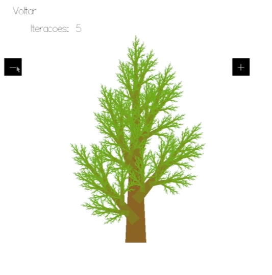

# Hasktal

# NomeDoProjeto
**Disciplina**: FGA0210 - PARADIGMAS DE PROGRAMAÇÃO - T01  
**Nro do Grupo (de acordo com a Planilha de Divisão dos Grupos)**: 02 
**Paradigma**: Funcional 

## Alunos
|Matrícula | Aluno |
| -- | -- |
| 21/1039288  |  Bruno Campos Ribeiro |
| 21/1039297  |  Bruno Martins Valério Bomfim |
| 20/2016462  |  Heitor Marques|
| 21/1029352  |  Igor e Silva Penha |
| 19/0057858  |  José Luís Ramos Teixeira |
| 21/1029405  |  Leonardo Gonçalves Machado |
| 20/2016767  |  Lucas Felipe Soares |
| 20/0062379  |  Marcos Vinícius de Deus |
| 20/2045268  |  Raquel Eucaria Pereira da Costa |
| 21/2002907  |  Zenilda Pedrosa Vieira |

## Sobre 
O projeto visa representar visualmente uma variedade de fractais gerados a partir de padrões repetitivos. Utilizando Haskell, serão desenvolvidos processos iterativos para criar diferentes tipos de fractais, explorando suas propriedades geométricas e características únicas derivadas de funções matemáticas específicas. 

Os fractais desenvolvidos foram:

#### Conjunto de Julia:

#### Curva de Koch:

#### Conjunto de Mandelbrot:

#### Árvore de Pitágoras:
O fractal conhecido como "Árvore de Pitágoras" é um tipo de fractal geométrico que se assemelha a uma árvore, sendo composto por trapezios dispostos de forma recursiva. Esse fractal tem seu nome em homenagem ao Teorema de Pitágoras, pois a construção de cada "galho" segue a relação desse teorema.

O algoritimo desenvolvido da árvore de pitágoras começa com um trapezio que representa o tronco da árvore. A partir dele, cinco trapezios menores são adicionados no topo, formando um ângulo em relação ao trapezio inicial, que simboliza os primeiros "galhos" da árvore. Esse processo é então repetido para cada novo trapezio, com uma rotação e uma escala que mantêm o formato e a proporção dos galhos, criando assim uma estrutura ramificada e cada vez mais complexa.

A complexidade da árvore é controlada pelo número de iterações (ou profundidade recursiva) aplicadas. Em um número baixo de iterações, a árvore terá uma estrutura mais simples, como na **Imagem 1** (com duas iterações). Já em um número maior de iterações, como na **Imagem 2** (com cinco iterações), a árvore exibe uma quantidade maior de detalhes e uma estrutura que se assemelha mais a uma árvore real.

  <figure style="display: inline-block; margin-right: 20px;">
    
    <figcaption><strong>Imagem 1</strong>: Árvore de Pitágoras com 2 interações</figcaption>
  </figure>
  <figure style="display: inline-block; margin-left: 20px;">
    
    <figcaption><strong>Imagem 2</strong>: Árvore de Pitágoras com 5 interações</figcaption>
  </figure>

#### Triângulo de Sierpinski:

#### Tapete de Sierpinsk:

## Screenshots
Adicione 2 ou mais screenshots do projeto em termos de interface e/ou funcionamento.

## Instalação 
**Linguagens**: Haskell 
**Tecnologias**: Gloss 

Descreva os pré-requisitos para rodar o seu projeto e os comandos necessários.
Insira um manual ou um script para auxiliar ainda mais.
Gifs animados e outras ilustrações são bem-vindos!

## Uso 
Explique como usar seu projeto.
Procure ilustrar em passos, com apoio de telas do software, seja com base na interface gráfica, seja com base no terminal.
Nessa seção, deve-se revelar de forma clara sobre o funcionamento do software.

## Vídeo
Adicione 1 ou mais vídeos com a execução do projeto.
Procure: 
(i) Introduzir o projeto;
(ii) Mostrar passo a passo o código, explicando-o, e deixando claro o que é de terceiros, e o que é contribuição real da equipe;
(iii) Apresentar particularidades do Paradigma, da Linguagem, e das Tecnologias, e
(iV) Apresentar lições aprendidas, contribuições, pendências, e ideias para trabalhos futuros.
OBS: TODOS DEVEM PARTICIPAR, CONFERINDO PONTOS DE VISTA.
TEMPO: +/- 15min

## Participações
Apresente, brevemente, como cada membro do grupo contribuiu para o projeto.
|Nome do Membro | Contribuição | Significância da Contribuição para o Projeto (Excelente/Boa/Regular/Ruim/Nula) | Comprobatórios (ex. links para commits)
| -- | -- | -- | -- |
| Fulano  |  Programação dos Fatos da Base de Conhecimento Lógica | Boa | Commit tal (com link)

## Outros 
Quaisquer outras informações sobre o projeto podem ser descritas aqui. Não esqueça, entretanto, de informar sobre:

(i) Lições Aprendidas;

(ii) Percepções;

(iii) Contribuições e Fragilidades, e

(iV) Trabalhos Futuros.

## Fontes
1. HASKELL. Documentação do Haskell. Disponível em: <https://www.haskell.org/documentation>. Acesso em: 02 de Novembro de 2024.
2. Wikipedia. Fractal. Disponível em: <https://pt.wikipedia.org/wiki/Fractal>. Acesso em: 02 de Novembro de 2024.
