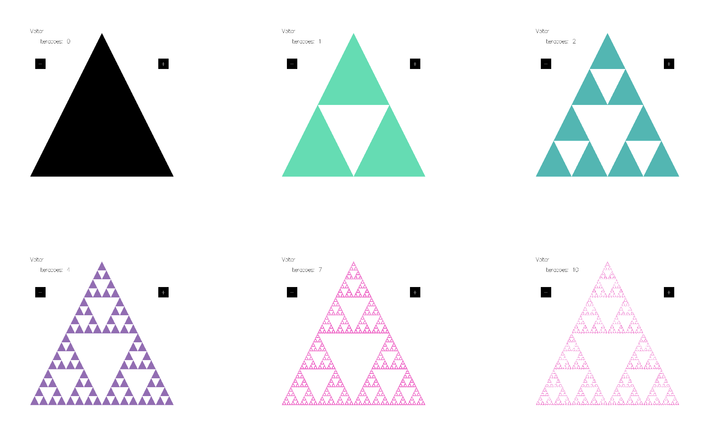

# Descrição dos fractais do projeto Hasktal

## Introdução

_definição de fractal, etc..._

## Metodologia

_trabalho em grupo de 10 pessoas, divisão em duplas, etc..._

## Fractais Desenvolvidos

### Conjunto de Julia:

_descrição, etc..._

  <figure style="display: inline-block; margin-right: 20px;">
    
    <figcaption> <strong>Imagem 1</strong>: Conjunto de Julia com ??? interações</figcaption>
  </figure>
  
<b>Fonte:</b> <strong>Fonte:</strong> <a href="https://github.com/leonardogonmac">Leonardo Machado</a> e <a href="https://github.com/lucasfs1007">Lucas Felipe</a>, 2024

### Curva de Dragão:

_descrição, etc..._

  <figure style="display: inline-block; margin-right: 20px;">
    
    <figcaption> <strong>Imagem 2</strong>: Curva de Dragão com ??? interações</figcaption>
  </figure>
  
<b>Fonte:</b> <strong>Fonte:</strong> <a href="https://github.com/joseluis-rt">José Luís</a> e <a href="https://github.com/igorpenhaa">Igor Penha</a>, 2024

### Curva de Koch:

A Curva de Koch é um fractal gerado por um algoritmo iterativo, que segue o seguinte processo geométrico:

1. Iniciar com um segmento de comprimento L. 
2. Retirar o terço médio do segmento inicial. 
3. Substituir o terço médio por um triângulo equilátero sem base de lado igual ao terço do segmento original.

Esse processo é repetido recursivamente para cada segmento gerado, aumentando a complexidade da figura a cada iteração. O algoritmo segue esse ciclo em cada iteração, produzindo uma curva que se torna progressivamente mais detalhada e auto-similar, caracterizando o comportamento fractal da Curva de Koch. 
Na **Imagem 3**, podemos observar a construção da curva conforme as iterações vão aumentando.

  <figure style="display: inline-block; margin-right: 20px;">
    
    <figcaption> <strong>Imagem 3</strong>: Fractal Curva de Koch 
<b>Fonte: </b><a href="https://github.com/gitbmvbs">Bruno Martins</a> e <a href="https://github.com/raqueleucaria">Raquel Eucaria</a>, 2024
 </figcaption>
  </figure>

### Conjunto de Mandelbrot:

O fractal de Mandelbrot é um dos fractais mais famosos e fascinantes. O fractal é definido pelo conjunto de todos os pontos complexos 
para os quais a sequência gerada pela fórmula iterativa:

  <figure style="display: inline-block; margin-right: 20px;">
    
    <figcaption> <strong>Imagem 4</strong>: Fórmula do conjunto de Mandelbrot   <strong>Fonte:</strong> <a href="https://github.com/lucasfs1007">Lucas Felipe</a>, 2024</figcaption>
  </figure>

Algoritmicamente, o fractal de Mandelbrot é gerado ao iterar uma fórmula para cada ponto de uma grade de pixels, normalmente representada no plano complexo Cada ponto é tratado como um número complexo sendo sobre eles aplicado a fórmula anterior repetidamente para verificar se 
z diverge (escapa para o infinito) ou permanece limitado. Na **Imagem 5** vamos visualizar como fica a imagem deste fractal em seu momento inicial, posteriormente, na **imagem 6**, vamos demonstrar após dadas iterações:

  <figure style="display: inline-block; margin-right: 20px;">
    
    <figcaption> <strong>Imagem 5:</strong> Fractal de Mandelbrot, sem nenhuma iteração   <strong>Fonte:</strong> <a href="https://github.com/leonardogonmac">Leonardo Machado</a> e <a href="https://github.com/lucasfs1007">Lucas Felipe</a>, 2024</figcaption>
  </figure>

  <figure style="display: inline-block; margin-right: 20px;">
    
    <figcaption> <strong>Imagem 6:</strong> Fractal de Mandelbrot, após algumas iterações   <strong>Fonte:</strong> <a href="https://github.com/leonardogonmac">Leonardo Machado</a> e <a href="https://github.com/lucasfs1007">Lucas Felipe</a>, 2024</figcaption>
  </figure>

### Árvore de Pitágoras:

O fractal conhecido como "Árvore de Pitágoras" é um tipo de fractal geométrico que se assemelha a uma árvore, sendo composto por trapezios dispostos de forma recursiva. Esse fractal tem seu nome em homenagem ao Teorema de Pitágoras, pois a construção de cada "galho" segue a relação desse teorema.

O algoritimo desenvolvido da árvore de pitágoras começa com um trapezio que representa o tronco da árvore. A partir dele, cinco trapezios menores são adicionados no topo, formando um ângulo em relação ao trapezio inicial, que simboliza os primeiros "galhos" da árvore. Esse processo é então repetido para cada novo trapezio, com uma rotação e uma escala que mantêm o formato e a proporção dos galhos, criando assim uma estrutura ramificada e cada vez mais complexa.

A complexidade da árvore é controlada pelo número de iterações (ou profundidade recursiva) aplicadas. Em um número baixo de iterações, a árvore terá uma estrutura mais simples, como na **Imagem 7** (com duas iterações). Já em um número maior de iterações, como na **Imagem 8** (com cinco iterações), a árvore exibe uma quantidade maior de detalhes e uma estrutura que se assemelha mais a uma árvore real.

  <figure style="display: inline-block; margin-right: 20px;">
    
    <figcaption> <strong>Imagem 7</strong>: Árvore de Pitágoras com 2 interações</figcaption>
  </figure>
<!-- 

 -->
  <figure style="display: inline-block; margin-left: 20px;">
    
    <figcaption> <strong>Imagem 8</strong>: Árvore de Pitágoras com 5 interações</figcaption>
  </figure>
  
<b>Fonte:</b> <a href="https://github.com/heitormsb">Heitor Marques</a> e <a href="https://github.com/Marcos574">Marcos Vinícius</a>, 2024

### Árvore de Pitágoras de quadrados:

_descrição, etc..._

  <figure style="display: inline-block; margin-right: 20px;">
    
    <figcaption> <strong>Imagem 9</strong>: Árvore de Pitágoras de quadrados com 6 interações</figcaption>
  </figure>
<!-- 

 -->
  <figure style="display: inline-block; margin-left: 20px;">
    
    <figcaption> <strong>Imagem 10</strong>: Árvore de Pitágoras de quadrados com 15 interações</figcaption>
  </figure>
  
<b>Fonte:</b> <a href="https://github.com/BrunoRiibeiro">Bruno Ribeiro</a> e <a href="https://github.com/zenildavieira">Zenilda Vieira</a>, 2024

### Triângulo de Sierpinski:

O Triângulo de Sierpinski é um fractal e um exemplo de um conjunto auto-similar, onde uma figura é composta por cópias de si mesma. Ele foi descrito pelo matemático polonês Wacław Sierpiński em 1915 e é obtido por um processo de divisão recursiva de triângulos. A construção começa com um triângulo equilátero e, em cada iteração, os triângulos menores são removidos para formar uma nova geração do fractal.

##### Propriedades e Curiosidades

* O Triângulo de Sierpinski possui auto-similaridade exata, o que significa que, independentemente do nível de ampliação, ele sempre parece o mesmo. Isso é característico de fractais, onde as partes menores replicam o todo.
* O fractal é criado por um processo recursivo, onde um triângulo é repetidamente subdividido em triângulos menores.
* Embora seja construído em um espaço bidimensional, o Triângulo de Sierpinski possui uma dimensão fractal entre 1 e 2. Sua dimensão é log(3)/log(2) ≈ 1,585, refletindo o fato de que ele ocupa mais espaço do que uma linha, mas menos do que uma área bidimensional completa.
* À medida que o processo de subdivisão continua indefinidamente, a área do Triângulo de Sierpinski converge para zero. Isso ocorre porque, em cada etapa, uma fração do triângulo original é removida.
* O perímetro, no entanto, aumenta a cada iteração, tornando-se infinitamente longo. Esse comportamento ilustra a diferença entre área e perímetro em fractais e em formas geométricas clássicas.

##### Lógica implementada do Triângulo de Sierpinski
* Passo 1: Comece com um triângulo equilátero.
* Passo 2: Divida o triângulo em quatro triângulos menores conectando os pontos médios de cada lado.
* Passo 3: Remova o triângulo central.
* Passo 4: Repita os passos 2 e 3 para cada um dos triângulos restantes.

##### Extra
Adição da mudança de cor dos triângulos restantes por meio da função makeColor, para que a mudança ocorrece a cada interação foi utilizada a função fromIntegral passando como argumento a profundidadde da interação. Dessa maneira, cada interação irá obter sua própria coloração de triângulos.

A seguir, na **imagem 11**, podemos observar a construção do fractal conforme as iterações vão aumentando.

  <figure style="display: inline-block; margin-right: 20px;">
    
    <figcaption> <strong>Imagem 11</strong>: Fractal triângulo de Sierpinski</figcaption>
  </figure>
  
<b>Fonte:</b> <strong>Fonte:</strong> <a href="https://github.com/joseluis-rt">José Luís</a> e <a href="https://github.com/igorpenhaa">Igor Penha</a>, 2024

### Tapete de Sierpinski:

_descrição, etc..._

  <figure style="display: inline-block; margin-right: 20px;">
    
    <figcaption> <strong>Imagem 12</strong>: Tapete de Sierpinski com 1 interações</figcaption>
  </figure>
<!-- 

 -->
  <figure style="display: inline-block; margin-left: 20px;">
    
    <figcaption> <strong>Imagem 13</strong>: Tapete de Sierpinski com 7 interações</figcaption>
  </figure>
  
<b>Fonte:</b>  <a href="https://github.com/BrunoRiibeiro">Bruno Ribeiro</a> e <a href="https://github.com/zenildavieira">Zenilda Vieira</a>

## Fontes
1. Wikipedia. Fractal. Disponível em: <https://pt.wikipedia.org/wiki/Fractal>. Acesso em: 02 de Novembro de 2024.
2. HOROBINSKI, Danyelle; FURTADO, Jéssica Gomes. Percorrendo a Curva de Koch. Curitiba, novembro de 2019. Disponível em: <https://docs.ufpr.br/~ewkaras/ensino/fractais/Koch.pdf>. Acesso em: 08 de Novembro de 2024.