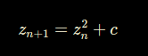
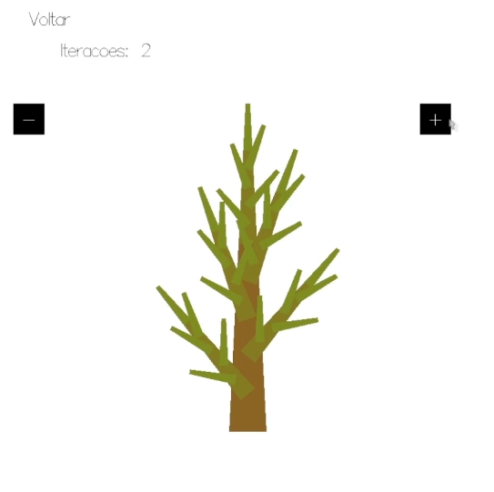
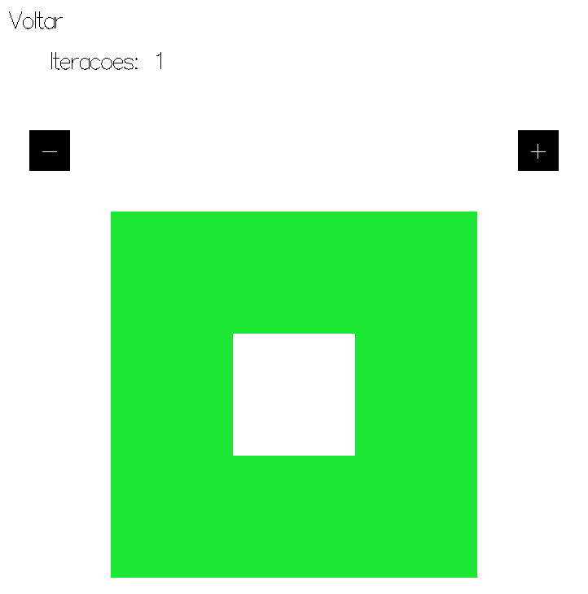

# Descrição dos fractais do projeto Hasktal

## Introdução

Fractais são estruturas geométricas caracterizadas por padrões que se repetem em diferentes escalas, suas partes se assemelham ao todo quando observadas em diferentes níveis de ampliação. Este conceito foi formalizado pelo matemático Benoit Mandelbrot em 1970, embora estruturas fractais já fossem conhecidas na matemática desde o século XX, feitas por Helge von Koch, Gaston Julia, Pierre Fatou e outros.

Os fractais são produzidos por processos iterativos, onde uma fórmula matemática simples é repetida várias vezes, gerando uma estrutura complexa, mantêndo suas características principais em diferentes escalas, de acordo com Eduardo Colli, professor do Instituto de Matemática e Estatística da USP, os fractais possuem uma estrutura composta por réplicas de si mesmos em diferentes escalas; cada parte contém cópias menores, que também replicam o padrão em escalas sucessivas.

## Metodologia

O tema escolhido foi fractais pois foi observado que as principais características do Haskell como linguagem funcional se harmonizam perfeitamente com a construção desses elementos. 
* A **imutabilidade** e **recursão** é aplicada na construção por repetidas subdivisões e cálculos recursivos, onde cada "passo" de uma iteração ou recursão gera uma nova versão da estrutura sem modificar a anterior. 
* O uso de **funções de alta ordem**, que recebem e retornam outras funções (**composição de funções**) é ideal para criar e compor as transformações geométricas usadas nos fractais, como escala, rotação e translação, que podem ser aplicadas repetidamente em cada etapa da construção.
* O suporte a funções puras (**expressividade com abstração**) e ênfase em expressividade matemática (**clareza matemática**), permite que o algoritmo fractal seja descrito de forma compacta e declarativa. Na Árvore de Pitágoras, por exemplo, uma função pura pode descrever o posicionamento e o tamanho de cada novo quadrado sem depender de variáveis externas.
* A linguagem Haskell usa avaliação preguiçosa, ou "**lazy evaluation**", o que significa que ela apenas calcula valores quando são realmente necessários. Isso é útil para fractais, pois permite que apenas os níveis de profundidade visíveis ou necessários sejam calculados, economizando recursos e permitindo visualizações parciais da estrutura. Com isso, é possível, por exemplo, definir um fractal de maneira infinita (**estruturas infinito**) e calcular os detalhes apenas conforme a necessidade de exibição, como quando o usuário aumenta o nível de iteração.

Após a escolha do tema fractais, os 10 integrantes do grupo foram separados em duplas e ficou acordado que cada dupla implementaria no mínimo um fractal. Posteriormente, a interface seria definida, a partir das ideias que surgissem. 

## Fractais Desenvolvidos

### Conjunto de Julia:

_descrição, etc..._

  <figure style="display: inline-block; margin-right: 20px;">
    
    <figcaption> <strong>Imagem 1</strong>: Conjunto de Julia com ??? interações</figcaption>
  </figure>
  
<b>Fonte:</b> <strong>Fonte:</strong> <a href="https://github.com/leonardogonmac">Leonardo Machado</a> e <a href="https://github.com/lucasfs1007">Lucas Felipe</a>, 2024

### Curva de Dragão:

A Curva de Dragão, também conhecida como Heighway Dragon, é um fractal gerado por um processo iterativo simples, mas que resulta em uma figura complexa e auto-similar. O fractal foi nomeado em homenagem aos matemáticos John Heighway, Bruce Banks e William Harter, que o descreveram pela primeira vez em 1960.

O processo de geração da Curva de Dragão começa com uma linha reta. A cada iteração, a linha é "dobrada" de forma que cria um padrão em zigue-zague. A cada iteração, a curva vai adquirindo uma forma que lembra a silhueta de um dragão (daí o nome), com a característica de se tornar cada vez mais detalhada à medida que mais iterações são aplicadas.

1. Inicie com uma linha reta. 
2. Dobre a linha em 90 graus para a esquerda (ou direita, dependendo da direção).
3. Repita o processo para cada segmento gerado.

Esse processo é repetido recursivamente em cada segmento, e cada nova iteração adiciona mais complexidade à figura. A Curva de Dragão tem a característica de ser uma curva contínua, mas não diferenciável, e a cada iteração, ela se aproxima de uma forma que parece um dragão, como uma linha que se dobra sobre si mesma.

  <figure style="display: inline-block; margin-right: 20px;">
    
    <figcaption> <strong>Imagem 2</strong>: Fractal Curva de Dragão (Heighway Dragon)</figcaption>
  </figure>
  
<b>Fonte:</b> <strong>Fonte:</strong> <a href="https://github.com/joseluis-rt">José Luís</a> e <a href="https://github.com/igorpenhaa">Igor Penha</a>, 2024

### Curva de Koch:

A Curva de Koch é um fractal gerado por um algoritmo iterativo, que segue o seguinte processo geométrico:

1. Iniciar com um segmento de comprimento L. 
2. Retirar o terço médio do segmento inicial. 
3. Substituir o terço médio por um triângulo equilátero sem base de lado igual ao terço do segmento original.

Esse processo é repetido recursivamente para cada segmento gerado, aumentando a complexidade da figura a cada iteração. O algoritmo segue esse ciclo em cada iteração, produzindo uma curva que se torna progressivamente mais detalhada e auto-similar, caracterizando o comportamento fractal da Curva de Koch. 
Na **Imagem 3**, podemos observar a construção da curva conforme as iterações vão aumentando.

  <figure style="display: inline-block; margin-right: 20px;">
    
    <figcaption> <strong>Imagem 3</strong>: Fractal Curva de Koch 
<b>Fonte: </b><a href="https://github.com/gitbmvbs">Bruno Martins</a> e <a href="https://github.com/raqueleucaria">Raquel Eucaria</a>, 2024
 </figcaption>
  </figure>

### Conjunto de Mandelbrot:

O fractal de Mandelbrot é um dos fractais mais famosos e fascinantes. O fractal é definido pelo conjunto de todos os pontos complexos 
para os quais a sequência gerada pela fórmula iterativa:

  <figure style="display: inline-block; margin-right: 20px;">
    
    <figcaption> <strong>Imagem 4</strong>: Fórmula do conjunto de Mandelbrot   <strong>Fonte:</strong> <a href="https://github.com/lucasfs1007">Lucas Felipe</a>, 2024</figcaption>
  </figure>

Algoritmicamente, o fractal de Mandelbrot é gerado ao iterar uma fórmula para cada ponto de uma grade de pixels, normalmente representada no plano complexo Cada ponto é tratado como um número complexo sendo sobre eles aplicado a fórmula anterior repetidamente para verificar se 
z diverge (escapa para o infinito) ou permanece limitado. Na **Imagem 5** vamos visualizar como fica a imagem deste fractal em seu momento inicial, posteriormente, na **imagem 6**, vamos demonstrar após dadas iterações:

  <figure style="display: inline-block; margin-right: 20px;">
    
    <figcaption> <strong>Imagem 5:</strong> Fractal de Mandelbrot, sem nenhuma iteração   <strong>Fonte:</strong> <a href="https://github.com/leonardogonmac">Leonardo Machado</a> e <a href="https://github.com/lucasfs1007">Lucas Felipe</a>, 2024</figcaption>
  </figure>

  <figure style="display: inline-block; margin-right: 20px;">
    
    <figcaption> <strong>Imagem 6:</strong> Fractal de Mandelbrot, após algumas iterações   <strong>Fonte:</strong> <a href="https://github.com/leonardogonmac">Leonardo Machado</a> e <a href="https://github.com/lucasfs1007">Lucas Felipe</a>, 2024</figcaption>
  </figure>

### Árvore de Pitágoras:

O fractal conhecido como "Árvore de Pitágoras" é um tipo de fractal geométrico que se assemelha a uma árvore, sendo composto por trapezios dispostos de forma recursiva. Esse fractal tem seu nome em homenagem ao Teorema de Pitágoras, pois a construção de cada "galho" segue a relação desse teorema.

O algoritmo desenvolvido da árvore de pitágoras começa com um trapezio que representa o tronco da árvore. A partir dele, cinco trapezios menores são adicionados no topo, formando um ângulo em relação ao trapezio inicial, que simboliza os primeiros "galhos" da árvore. Esse processo é então repetido para cada novo trapezio, com uma rotação e uma escala que mantêm o formato e a proporção dos galhos, criando assim uma estrutura ramificada e cada vez mais complexa.

A complexidade da árvore é controlada pelo número de iterações (ou profundidade recursiva) aplicadas. Em um número baixo de iterações, a árvore terá uma estrutura mais simples, como na **Imagem 7** (com duas iterações). Já em um número maior de iterações, como na **Imagem 8** (com cinco iterações), a árvore exibe uma quantidade maior de detalhes e uma estrutura que se assemelha mais a uma árvore real.

  <figure style="display: inline-block; margin-right: 20px;">
    
    <figcaption> <strong>Imagem 7</strong>: Árvore de Pitágoras com 2 interações</figcaption>
  </figure>
  
<b>Fonte:</b> <a href="https://github.com/heitormsb">Heitor Marques</a> e <a href="https://github.com/Marcos574">Marcos Vinícius</a>, 2024

  <figure style="display: inline-block; margin-left: 20px;">
    
    <figcaption> <strong>Imagem 8</strong>: Árvore de Pitágoras com 5 interações</figcaption>
  </figure>
  
<b>Fonte:</b> <a href="https://github.com/heitormsb">Heitor Marques</a> e <a href="https://github.com/Marcos574">Marcos Vinícius</a>, 2024

### Árvore de Pitágoras de quadrados:

A Árvore de Pitágoras é um tipo de fractal inspirado na geometria dos triângulos retângulos e na relação dos quadrados em seus lados. Esse fractal começa com um quadrado, e, a partir dele, outros quadrados menores são adicionados em seus cantos superiores. Cada novo par de quadrados é posicionado em um ângulo que lembra o crescimento de galhos de uma árvore. Esse processo de "ramificação" é repetido diversas vezes, criando uma figura que se assemelha a uma árvore estilizada, com padrões simétricos e repetitivos. A beleza da Árvore de Pitágoras está em como formas simples, repetidas de forma organizada, resultam em uma estrutura complexa e intrigante.

Conforme mostra a **imagem 8**, os triângulos traçados com linhas vermelhas estabelecem uma relação pitagórica entre três quadrados: o quadrado da base possui uma área que é a soma das áreas dos dois quadrados adicionados na próxima etapa. As variações nas árvores resultam apenas da escolha do triângulo utilizado para definir o tamanho e a orientação dos quadrados em cada nível do fractal.

  <figure style="display: inline-block; margin-right: 20px;">
    
    <figcaption> <strong>Imagem 8</strong>: Relação pitagórica entre três quadrados</figcaption>
  </figure>
  
<b>Fonte:</b> <a href="http://learn.hfm.io/fractals.html">Spirals, Snowflakes & Trees: Recursion in Pictures</a>

Nas **imagens 9** e **10** é mostrada a árvore gerada com 5 iterações e depois com 15 iterações.

  <figure style="display: inline-block; margin-right: 20px;">
    
    <figcaption> <strong>Imagem 9</strong>: Árvore de Pitágoras de quadrados com 6 interações</figcaption>
  </figure>
  
<b>Fonte:</b> <a href="https://github.com/BrunoRiibeiro">Bruno Ribeiro</a> e <a href="https://github.com/zenildavieira">Zenilda Vieira</a>, 2024

  <figure style="display: inline-block; margin-left: 20px;">
    
    <figcaption> <strong>Imagem 10</strong>: Árvore de Pitágoras de quadrados com 15 interações</figcaption>
  </figure>
  
<b>Fonte:</b> <a href="https://github.com/BrunoRiibeiro">Bruno Ribeiro</a> e <a href="https://github.com/zenildavieira">Zenilda Vieira</a>, 2024

### Triângulo de Sierpinski:

O Triângulo de Sierpinski é um fractal e um exemplo de um conjunto auto-similar, onde uma figura é composta por cópias de si mesma. Ele foi descrito pelo matemático polonês Wacław Sierpiński em 1915 e é obtido por um processo de divisão recursiva de triângulos. A construção começa com um triângulo equilátero e, em cada iteração, os triângulos menores são removidos para formar uma nova geração do fractal.

##### Propriedades e Curiosidades

* O Triângulo de Sierpinski possui auto-similaridade exata, o que significa que, independentemente do nível de ampliação, ele sempre parece o mesmo. Isso é característico de fractais, onde as partes menores replicam o todo.
* O fractal é criado por um processo recursivo, onde um triângulo é repetidamente subdividido em triângulos menores.
* Embora seja construído em um espaço bidimensional, o Triângulo de Sierpinski possui uma dimensão fractal entre 1 e 2. Sua dimensão é log(3)/log(2) ≈ 1,585, refletindo o fato de que ele ocupa mais espaço do que uma linha, mas menos do que uma área bidimensional completa.
* À medida que o processo de subdivisão continua indefinidamente, a área do Triângulo de Sierpinski converge para zero. Isso ocorre porque, em cada etapa, uma fração do triângulo original é removida.
* O perímetro, no entanto, aumenta a cada iteração, tornando-se infinitamente longo. Esse comportamento ilustra a diferença entre área e perímetro em fractais e em formas geométricas clássicas.

##### Lógica implementada do Triângulo de Sierpinski
* Passo 1: Comece com um triângulo equilátero.
* Passo 2: Divida o triângulo em quatro triângulos menores conectando os pontos médios de cada lado.
* Passo 3: Remova o triângulo central.
* Passo 4: Repita os passos 2 e 3 para cada um dos triângulos restantes.

##### Extra
Adição da mudança de cor dos triângulos restantes por meio da função makeColor, para que a mudança ocorrece a cada interação foi utilizada a função fromIntegral passando como argumento a profundidadde da interação. Dessa maneira, cada interação irá obter sua própria coloração de triângulos.

A seguir, na **imagem 11**, podemos observar a construção do fractal conforme as iterações vão aumentando.

  <figure style="display: inline-block; margin-right: 20px;">
    
    <figcaption> <strong>Imagem 11</strong>: Fractal triângulo de Sierpinski</figcaption>
  </figure>
  
<b>Fonte:</b> <strong>Fonte:</strong> <a href="https://github.com/joseluis-rt">José Luís</a> e <a href="https://github.com/igorpenhaa">Igor Penha</a>, 2024

### Tapete de Sierpinski:

O tapete _Sierpiński_ é um fractal plano descrito pela primeira vez por Wacław Sierpiński em 1916.  O tapete é uma generalização do conjunto de Cantor definido para duas dimensões; outra generalização é o pó de Cantor.

Em matemática, o conjunto de Cantor é um conjunto de pontos situados em um único segmento de reta que possui uma série de propriedades não intuitivas.  Através da consideração deste conjunto, Cantor e outros ajudaram a estabelecer as bases da topologia moderna de conjunto de pontos. A construção mais comum é o conjunto ternário de Cantor, construído removendo o terço médio de um segmento de reta e repetindo o processo com os demais segmentos mais curtos.

  <figure style="display: inline-block; margin-right: 20px;">
    
    <figcaption> <strong>Imagem 12</strong>: Exemplo conjunto de Cantor ternário</figcaption>
  </figure>
  
<b>Fonte:</b>  <a href="https://github.com/BrunoRiibeiro">Bruno Ribeiro</a> </a>

  <figure style="display: inline-block; margin-right: 20px;">
    
    <figcaption> <strong>Imagem 13</strong>: Exemplo pó de Cantor</figcaption>
  </figure>
  
<b>Fonte:</b>  <a href="https://github.com/BrunoRiibeiro">Bruno Ribeiro</a>

A construção do tapete Sierpiński começa com um quadrado. O quadrado é cortado em 9 subquadrados congruentes em uma grade 3 por 3, e o subquadrado central é removido. O mesmo procedimento é então aplicado recursivamente aos 8 subquadrados restantes, _ad infinitum_. Pode ser realizado como o conjunto de pontos no quadrado unitário cujas coordenadas escritas na base três não possuem ambos um dígito '1' na mesma posição, usando a representação numérica infinitesimal de 0.1111... = 0.2.

  <figure style="display: inline-block; margin-right: 20px;">
    
    <figcaption> <strong>Imagem 14</strong>: Tapete de Sierpinski com 1 interação</figcaption>
  </figure>
  
<b>Fonte:</b>  <a href="https://github.com/BrunoRiibeiro">Bruno Ribeiro</a> e <a href="https://github.com/zenildavieira">Zenilda Vieira</a>

  <figure style="display: inline-block; margin-left: 20px;">
    
    <figcaption> <strong>Imagem 15</strong>: Tapete de Sierpinski com 7 interações</figcaption>
  </figure>
  
<b>Fonte:</b>  <a href="https://github.com/BrunoRiibeiro">Bruno Ribeiro</a> e <a href="https://github.com/zenildavieira">Zenilda Vieira</a>

## Fontes

> 1. Wikipedia. Fractal. Disponível em: <https://pt.wikipedia.org/wiki/Fractal>. Acesso em: 02 de Novembro de 2024.
> 2. HOROBINSKI, Danyelle; FURTADO, Jéssica Gomes. Percorrendo a Curva de Koch. Curitiba, novembro de 2019. Disponível em: <https://docs.ufpr.br/~ewkaras/ensino/fractais/Koch.pdf>. Acesso em: 08 de Novembro de 2024.
> 3. Matemateca IME USP. FRACTAIS. Disponível em: <https://matemateca.ime.usp.br/acervo/fractais.html>. Acesso em: 08 de Novembro de 2024.
> 4. Fractais. Fractais. Disponível em: <https://www.aedi.ufpa.br/bom/images/pdf/Fractais.pdf>. Acesso em: 08 de Novembro de 2024.
> 5. Urich, Rohan. The Dragon Curve (and a bit on Fractals). Disponível em: <https://rohanurich.wordpress.com/tag/heighway-dragon/>. Acesso em: 09 de Novembro de 2024.
> 6. Spirals, Snowflakes & Trees: Recursion in Pictures. Dispónivel em: <http://learn.hfm.io/fractals.html>. Acesso em: 06 de Novembro de 2024.

## Histórico de Versões

| Versão | Data       | Descrição                                                                      |                                                 Autor                                                 |
| :----: | ---------- | ------------------------------------------------------------------------------ | :---------------------------------------------------------------------------------------------------: |
| `1.0`  | 09/11/2024 | Documentação da Árvore de Pitágoras                                            | [Heitor Marques](https://github.com/heitormsb)   [Marcos Vinícius]("https://github.com/Marcos574)  |
| `1.1`  | 09/11/2024 | Documentação da Mandelbrot                                                     | [Lucas Felipe](https://github.com/lucasfs)   [Leonardo Machado](https://github.com/leonardogonmac) |
| `1.2`  | 10/11/2024 | Descrição da Curva de Koch                                                     | [Bruno Martins](https://github.com/gitbmvbs)   [Raquel Eucaria](https://github.com/raqueleucaria)  |
| `1.3`  | 10/11/2024 | Formatação do documento e inclusão de imagens Fractal Tree e Sierpinski Carpet |                          [Zenilda Vieira](https://github.com/zenildavieira)                           |
| `1.4`  | 10/11/2024 | Descrição do Triângulo de Sierpinski e da Curva do Dragão                      |     [José Luís](https://github.com/joseluis-rt)   [Igor Penha](https://github.com/igorpenhaa)      |
| `1.5`  | 10/11/2024 | Introdução                                                                     |                            [Heitor Marques](https://github.com/heitormsb)                             |
| `1.6`  | 10/11/2024 | Documentação Sierpinski Carpet                                                 |                         [Bruno Ribeiro](https://github.com/BrunoRiibeiro.com)                         |
| `1.7`  | 10/11/2024 | Metodologia e Documentação da Árvore de Pitágoras de quadrados                 |                          [Zenilda Vieira](https://github.com/zenildavieira)                           |